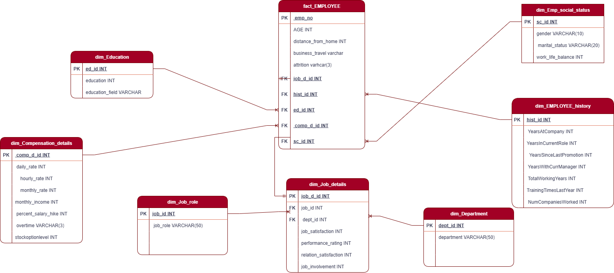

# SQL-DWH-Project-
# HR Attrition Analysis & Dashboards  

  
  
  

## Project Description
This project analyzes HR attrition data using SQL Server and creates interactive dashboards in Power BI. It focuses on understanding employee attrition patterns, job satisfaction, departmental performance, and gender-based insights.  

## Key Features
- SQL-based ETL and data quality checks  
- Dashboards in Power BI to visualize:  
  - Attrition by Job Satisfaction  
  - Attrition per Gender  
  - Line charts tracking trends over time  
  - Pie charts and scatter plots for detailed analysis  
- Interactive filtering and segmentation in dashboards  
- Includes SQL scripts and diagrams for DWH and workflow  

## Technologies Used
- SQL Server  
- Power BI  

## Data Source
The dataset used in this project is sourced from **Kaggle**: [HR Attrition Dataset](https://www.kaggle.com/datasets/pavansubhasht/ibm-hr-analytics-attrition-dataset)  

## Requirements
- SQL Server  
- Power BI Desktop  

## Project Files
- `SQL_scripts/` – contains all SQL ETL and transformation scripts  
- `Diagrams/` – contains DWH and workflow diagrams  
- `Dashboards/` – Power BI dashboard files  

## Diagrams Preview
  
  

